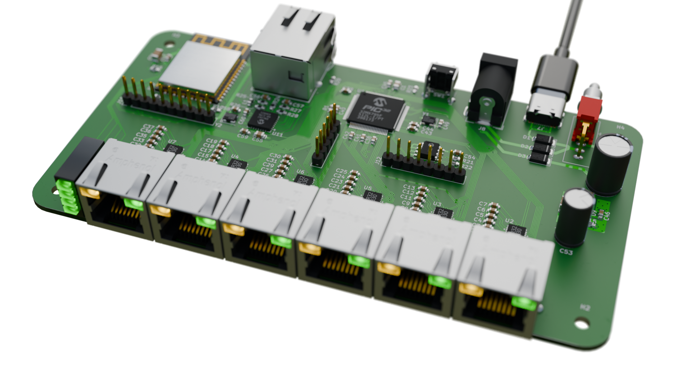

Open-source Terminal Server
===========================

This is a small 6 port serial terminal server with ethernet, USB and WiFi
connectivity.

**NOTE: THIS IS WORK IN PROGRESS AND NOT COMPLETE YET**

Current status:
---------------

* **Serial Ports:** Done
* **USB Ports:** Done
* **Ethernet:** Done
* **WiFi:** In progress
* **Telnet in:** Done
* **Telnet out:** Done
* **TCP in:** Done
* **TU58 Emulation:** Planned
* **PPP/SLIP:** Planned
